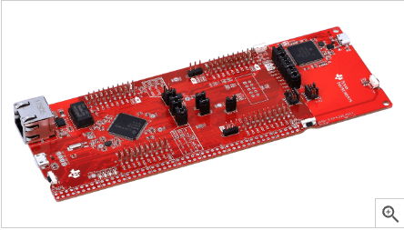
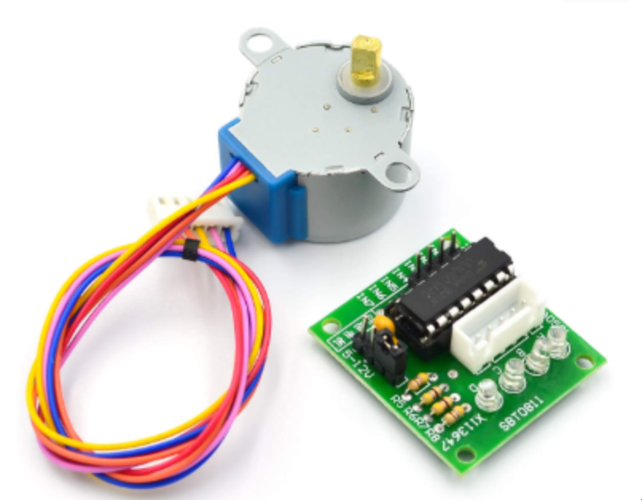

## 🛰️ Rotating LiDAR Scanner — 3D Point Cloud Generation with ToF Sensor, Microcontroller & Stepper Motor

<!-- Front-load a compelling result -->
<p align="center">
  
  <br/>
  <sub><b>Fig 1 — Hallway scan:</b> representative point cloud produced by the module.</sub>
</p>

> Imagine a device that spins around, measuring distances in every direction, then builds a 3D map of its surroundings. That's what this project does.  
> 
> Using a microcontroller, a distance sensor, and a stepper motor, we create a rotating scanner that captures spatial data and visualizes it as a point cloud—the same technology used in self-driving cars and robotics, but built from scratch.

---

## 📋 Table of Contents

- [How It Works](#-how-it-works)
- [System Architecture](#-system-architecture)
- [Hardware Components](#-hardware-components)
- [Mathematical Foundation](#-mathematical-foundation)
- [Measurement Model](#-measurement-model)
- [Real-World Applications](#-real-world-applications)
- [Project Structure](#-project-structure)
- [Getting Started](#-getting-started)
- [Results](#-results)
- [Performance & Limitations](#-performance--limitations)
- [Glossary](#-glossary)
- [License](#-license)

---

## 🔄 How It Works

The system works in four simple steps:

1. **Rotate** — A stepper motor spins the distance sensor 360 degrees
2. **Measure** — At each angle, the sensor records how far away objects are
3. **Stream** — The microcontroller sends this data to a computer via USB
4. **Visualize** — Software converts the measurements into a 3D point cloud

Think of it like a lighthouse beam sweeping around, but instead of light, it's measuring distances and building a map.

---

## ⚡ System Architecture

<p align="center">
  
  <br/>
  <sub><b>Fig 2 — Data flow:</b> initialization → step/measure → pack → UART → host visualization.</sub>
</p>

The system follows a structured data acquisition pipeline:

1. **Initialization Phase**
   - Configure I²C bus for sensor communication (100 kHz)
   - Initialize GPIO pins for stepper motor control
   - Set up UART for serial data transmission (115200 baud)
   - Reset and calibrate the VL53L1X ToF sensor

2. **Acquisition Loop**
   - Rotate stepper motor by one angular increment (12°)
   - Trigger distance measurement on VL53L1X
   - Wait for sensor data ready flag
   - Read distance value via I²C

3. **Data Processing**
   - Convert polar coordinates (angle, distance) to Cartesian (x, y, z)
   - Format data packet with XYZ coordinates
   - Transmit via UART to host computer

4. **Host Visualization**
   - Receive serial data stream
   - Parse XYZ coordinates
   - Render point cloud using Open3D library
   - Generate wireframe connections between points

---

## 🛠 Hardware Components

### Microcontroller: MSP432E401Y

<p align="center">
  
  <br/>
  <sub><b>MSP432E401Y</b> — ARM Cortex-M4F microcontroller with FPU</sub>
</p>

The MSP432E401Y serves as the central processing unit, coordinating all system operations.

- **Architecture:** ARM Cortex‑M4F with single-precision floating-point unit (FPU)
- **Clock Speed:** 120 MHz (configured via Phase-Locked Loop)
- **Memory:** 256 KB Flash for program storage, 32 KB SRAM for runtime data
- **Primary Functions:**
  - Motor control: Generates stepper motor phase sequences via GPIO
  - Sensor communication: Manages I²C protocol for VL53L1X
  - Data streaming: Formats and transmits point cloud data via UART
- **Communication Interfaces:**
  - I²C @ 100 kHz for sensor communication
  - UART @ 115200 bps for PC data link

### Time-of-Flight Sensor: VL53L1X

<p align="center">
  
  <br/>
  <sub><b>VL53L1X</b> — Long-range ToF sensor module</sub>
</p>

The VL53L1X provides precise distance measurements using time-of-flight technology.

- **Operating Range:** 0 to 4 meters
- **Measurement Rate:** Up to 50 Hz (20 ms per measurement)
- **Accuracy:** ±20 mm typical, ±50 mm maximum
- **Technology:** SPAD (Single-Photon Avalanche Diode) array with VCSEL (Vertical-Cavity Surface-Emitting Laser)
- **Communication:** I²C interface at address 0x29
- **Key Features:**
  - Multi-zone ranging capability
  - Ambient light rejection up to 100 klux
  - Programmable timing budgets (20-500 ms)
  - Interrupt-driven operation for efficient polling

### Stepper Motor: 28BYJ-48

<p align="center">
  
  <br/>
  <sub><b>28BYJ-48</b> — 5V unipolar stepper motor with gearbox and ULN2003 driver board</sub>
</p>

The 28BYJ-48 provides precise rotational positioning for the scanning mechanism.

- **Motor Type:** Unipolar 5-wire stepper motor
- **Full Steps per Revolution:** 2048 (before gearing)
- **Gear Ratio:** 64:1 reduction gearbox
- **Effective Resolution:** 4096 microsteps per full revolution (half-step mode)
- **Angular Resolution:** ~0.088° per microstep
- **Driver Circuit:** ULN2003 Darlington transistor array
- **Control Method:** 4-phase half-step sequence (8 states per cycle)
- **Stepping Sequence:** 
  ```
  Phase A: 0x09 → 0x03 → 0x06 → 0x0C → 0x09 (clockwise)
  Phase A: 0x09 → 0x0C → 0x06 → 0x03 → 0x09 (counterclockwise)
  ```

### Additional Components

- **ULN2003 Driver Board:** Provides current amplification for stepper motor coils (up to 500 mA per channel)
- **Control Buttons:** Active-low GPIO inputs for start/stop/pause functionality
- **LED Indicators:** Onboard LEDs provide visual feedback for system status and I²C operations

<!-- Circuit schematic placeholder -->
<p align="center">
  
  <br/>
  <sub><b>Fig 3 — Circuit schematic:</b> MSP432 ↔ VL53L1X (I²C), MSP432 ↔ ULN2003 (GPIO), control buttons.</sub>
</p>

---

## 🧮 Mathematical Foundation

### Coordinate System Transformation

The scanner operates in a **polar coordinate system** (angle θ, distance r) but outputs data in **Cartesian coordinates** (x, y, z) for visualization. Understanding this transformation is fundamental to the system's operation.

#### Polar to Cartesian Conversion

For a single measurement at angle θ and distance r:

$$
\begin{align}
x &= \text{translation offset} \quad \text{(incremented per sweep)} \\
y &= r \sin(\theta) \\
z &= r \cos(\theta)
\end{align}
$$

Where:
- **θ (theta)** is the rotational angle in radians (0 to 2π)
- **r** is the measured distance from sensor to object
- **x** represents the translation axis (incremented by 20 units between sweeps)
- **y** and **z** form the scanning plane perpendicular to the rotation axis

#### Angular Discretization

The system samples at discrete angular intervals:

- **Angular Step:** Δθ = 12° = π/15 radians
- **Samples per Sweep:** N = 360° / 12° = 30 measurements
- **Angular Resolution:** Determines the minimum feature size detectable

For an object at distance r, the **arc length** between samples is:

$$
s = r \cdot \Delta\theta = r \cdot \frac{\pi}{15}
$$

At maximum range (4 m), this yields ~84 cm between samples, while at 1 m range, it's ~21 cm.

### Point Cloud Generation

A complete scan consists of multiple sweeps, each producing a **slice** through the environment:

#### Single Sweep (2D Slice)

For sweep index k, with measurements at angles θᵢ:

$$
\begin{align}
x_k &= k \cdot \Delta x \quad \text{(translation increment)} \\
y_{k,i} &= r_{k,i} \sin(\theta_i) \\
z_{k,i} &= r_{k,i} \cos(\theta_i)
\end{align}
$$

Where:
- **k** is the sweep index (0, 1, 2, ...)
- **Δx = 20** units is the translation between sweeps
- **i** is the measurement index within the sweep (0 to 29)
- **θᵢ = i · 12°** is the angle for measurement i

#### 3D Reconstruction

Stacking multiple sweeps creates a volumetric point cloud:

$$
P = \{ (x_k, y_{k,i}, z_{k,i}) \mid k \in [0, N_{\text{sweeps}}), i \in [0, 30) \}
$$

The total number of points in a scan with N sweeps is:

$$
N_{\text{points}} = 30 \cdot N_{\text{sweeps}}
$$

### Measurement Uncertainty

Several factors contribute to measurement error:

#### Sensor Accuracy

The VL53L1X has inherent measurement uncertainty:

$$
\sigma_{\text{sensor}} = \pm 20 \text{ mm} \quad \text{(typical)}
$$

#### Angular Error

Stepper motor positioning introduces angular uncertainty:

$$
\sigma_{\theta} \approx \pm 0.1° \quad \text{(half-step precision)}
$$

This angular error propagates to spatial error:

$$
\sigma_y = r \cdot \sigma_{\theta} \cdot \cos(\theta)
$$

At 2 m range, this yields ~3.5 mm spatial error.

#### Total Uncertainty

Combining sensor and angular errors (assuming independence):

$$
\sigma_{\text{total}} = \sqrt{\sigma_{\text{sensor}}^2 + (r \cdot \sigma_{\theta})^2}
$$

---

## 📐 Measurement Model

### Implementation Details

The measurement process follows this mathematical model:

At measurement index \(i\) within sweep \(k\):

$$
\begin{align}
\theta_i &= i \cdot \frac{\pi}{15} \quad \text{(radians)} \\
r_{k,i} &= d_{\text{sensor}} \quad \text{(millimeters)} \\
x_k &= k \cdot 20 \\
y_{k,i} &= r_{k,i} \cdot \sin(\theta_i) \\
z_{k,i} &= r_{k,i} \cdot \cos(\theta_i)
\end{align}
$$

Where \(d_{\text{sensor}}\) is the distance measurement obtained from `VL53L1X_GetDistance()`.

### Coordinate System Convention

The system uses a **right-handed coordinate system**:

- **+X:** Forward translation direction (between sweeps)
- **+Y:** Horizontal plane (sine component)
- **+Z:** Vertical plane (cosine component)
- **Rotation:** Counterclockwise when viewed from above (standard mathematical convention)

### Data Format

Each measurement produces a single line of output:

```
x y z
```

Where x, y, z are integer values in millimeters. The Python visualization script parses these lines and constructs the point cloud.

### Sweep Pattern

The system alternates rotation direction between sweeps:

- **Even sweeps (k = 0, 2, 4, ...):** Clockwise rotation
- **Odd sweeps (k = 1, 3, 5, ...):** Counterclockwise rotation

This bidirectional pattern helps compensate for mechanical backlash and provides more uniform point distribution.

---

## 🌍 Real-World Applications

This low-cost LiDAR scanner demonstrates principles used in many real-world applications:

### 🚗 Autonomous Vehicles
- **Object Detection:** Identify obstacles, pedestrians, and other vehicles
- **Path Planning:** Generate 3D maps for navigation
- **Parking Assistance:** Precise distance measurement for parking systems

### 🏭 Industrial Automation
- **Quality Control:** 3D inspection of manufactured parts
- **Warehouse Robotics:** Inventory management and navigation
- **Collision Avoidance:** Safety systems for automated machinery

### 🏗️ Construction & Surveying
- **Building Mapping:** Create 3D models of structures
- **Volume Measurement:** Calculate material quantities
- **Site Planning:** Terrain mapping and obstacle detection

### 🤖 Robotics
- **SLAM (Simultaneous Localization and Mapping):** Build maps while navigating
- **Object Manipulation:** 3D perception for robotic arms
- **Exploration:** Unmanned systems for unknown environments

### 🏥 Medical Applications
- **Prosthetics:** 3D scanning for custom-fit devices
- **Surgical Planning:** Pre-operative imaging and measurement
- **Rehabilitation:** Motion tracking and analysis

### 🎮 Gaming & Entertainment
- **Room Scanning:** VR/AR environment mapping
- **Motion Capture:** 3D tracking for animation
- **Interactive Displays:** Gesture recognition systems

### 🔒 Security & Surveillance
- **Perimeter Monitoring:** Detect intrusions in 3D space
- **People Counting:** Track occupancy in real-time
- **Anomaly Detection:** Identify unusual objects or movements

---

## 📁 Project Structure

```
Rotational-3D-LiDAR-main/
├── src/                    # Source files (.c)
│   ├── main.c             # Main application code
│   ├── uart.c             # UART communication
│   ├── SysTick.c          # System tick timer
│   ├── PLL.c              # Phase-locked loop configuration
│   ├── onboardLEDs.c      # LED control
│   └── vl53l1_platform_2dx4.c  # VL53L1X platform layer
├── include/               # Header files (.h)
│   ├── uart.h
│   ├── SysTick.h
│   ├── PLL.h
│   ├── onboardLEDs.h
│   ├── vl53l1x_api.h      # VL53L1X API
│   ├── vl53l1_platform_2dx4.h
│   └── tm4c1294ncpdt.h     # MSP432 register definitions
├── python/                # Python visualization scripts
│   └── point_cloud_visualizer.py  # Data acquisition and visualization
├── docs/                   # Documentation
│   ├── VL53L1X Parameter documentation.pdf
│   └── VL53L1X_ULD_API_UM2510_Rev2.pdf
├── hardware/               # Hardware project files
│   ├── *.uvprojx          # Keil µVision project files
│   └── *.uvoptx
├── LICENSE                 # MIT License
└── README.md              # This file
```

---

## 🚀 Getting Started

### Prerequisites

**Hardware:**
- MSP432E401Y LaunchPad or compatible board
- VL53L1X ToF sensor module
- 28BYJ-48 stepper motor with ULN2003 driver board
- Jumper wires and breadboard
- USB cable for programming and UART communication

**Software:**
- Keil µVision 5 or compatible IDE
- Python 3.6-3.9 (for visualization)
- Required Python packages:
  ```bash
  pip install pyserial numpy open3d
  ```

### Building the Firmware

1. Open the project in Keil µVision (`hardware/*.uvprojx`)
2. Configure target settings for MSP432E401Y
3. Build the project (F7)
4. Flash to the microcontroller

### Running the Visualization

1. Connect the microcontroller via USB/UART adapter
2. Update the serial port in `python/point_cloud_visualizer.py`:
   ```python
   SERIAL_PORT = 'COM5'  # Windows
   # SERIAL_PORT = '/dev/ttyUSB0'  # Linux
   ```
3. Run the Python script:
   ```bash
   python python/point_cloud_visualizer.py
   ```
4. Follow prompts to specify number of sweeps
5. Press the start button on the microcontroller to begin scanning

### Usage Tips

- **Calibration:** Ensure the sensor is properly mounted and aligned
- **Lighting:** VL53L1X works best in moderate ambient light
- **Range:** Keep objects within 0.5-4 meters for best results
- **Stability:** Mount the system securely to minimize vibrations
- **Data Quality:** Multiple sweeps improve point cloud density

---

## 📈 Results

- **Hallway scans** reconstruct long straight surfaces (walls) and features beyond ~0.5 m.  
- **Object scans** produce dense clusters corresponding to target geometry.  
- Data accuracy is constrained by ToF latency and stepper jitter.  

<!-- Secondary result placeholder -->
<p align="center">
 
  <br/>
  <sub><b>Fig 4 — Secondary scan view:</b> additional rendering of the scanned environment.</sub>
</p>

### Typical Performance Metrics

- **Angular Resolution:** 12° per measurement (30 measurements per 360° sweep)
- **Scan Time:** ~2-3 seconds per sweep (depending on sensor timing)
- **Point Cloud Density:** 30 points per sweep × number of sweeps
- **Range Accuracy:** ±20 mm typical, ±50 mm maximum
- **Update Rate:** ~10-15 Hz effective (limited by sensor and stepper timing)

---

## ⚖️ Performance & Limitations

### Current Limitations

- **Sensor latency** is the bottleneck; dwell must allow VL53L1X to finish ranging.  
- **Serial link** limits throughput; UART bandwidth constrains density of streamed data.  
- **Motor precision**: missed steps or insufficient delays cause jitter.  
- **MCU math**: single‑precision FPU; heavier processing deferred to host side.

### Potential Improvements

- **Higher-speed communication:** Use USB or SPI instead of UART
- **Multiple sensors:** Array of ToF sensors for faster scanning
- **Better motor control:** Closed-loop feedback for precise positioning
- **On-device processing:** Implement filtering and compression on MCU
- **Wireless transmission:** Add Bluetooth or Wi-Fi for remote operation

---

## 🧠 Glossary

- **MCU** — Microcontroller Unit (MSP432E401Y).  
- **ToF** — Time‑of‑Flight ranging (VL53L1X).  
- **SPAD** — Single‑Photon Avalanche Diode (VL53L1X receiver).  
- **UART** — Universal Asynchronous Receiver/Transmitter.  
- **I²C** — Inter‑Integrated Circuit (sensor bus).  
- **FPU** — Floating‑Point Unit (single precision on MSP432).  
- **FOV** — Field of View.  
- **XYZ** — Cartesian coordinates of point‑cloud samples.  
- **Microstep** — Partial step of a stepper motor for finer resolution.  
- **SLAM** — Simultaneous Localization and Mapping.  
- **PLL** — Phase-Locked Loop (clock generation).  

---

## 📜 License

MIT — see `LICENSE`.

---

## 🙏 Acknowledgments

- **STMicroelectronics** for the VL53L1X sensor and API
- **Texas Instruments** for the MSP432E401Y microcontroller
- **Open3D** contributors for the visualization library
- **McMaster University** 2DX4 course materials

---

## 📞 Contact & Contributions

For questions, issues, or contributions, please open an issue or submit a pull request on GitHub.

---

<p align="center">
  <sub>Built with ❤️ for embedded systems education and 3D scanning enthusiasts</sub>
</p>
